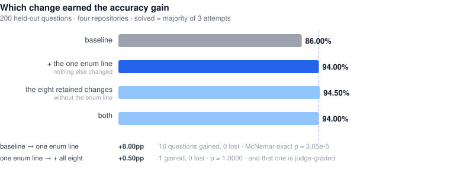
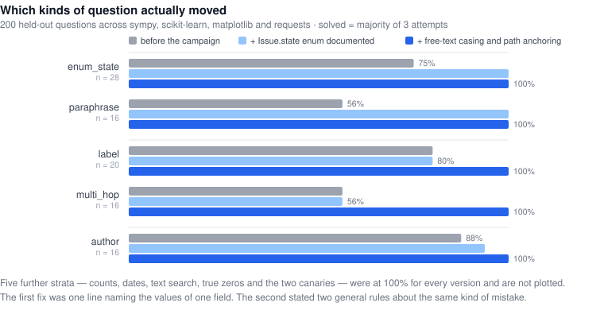

# GitHub Issue Analyzer

An agent that ingests GitHub issues into a Neo4j knowledge graph and answers questions
about them.

The system is ordinary. What is unusual is how it got faster and more accurate, and how
that was checked.

> **Every optimisation, benchmark and verification in this repository was carried out
> autonomously by [NEO](https://heyneo.com) — Your Autonomous AI Engineering Agent.**
> NEO profiled the codebase, built the benchmark, ran the optimisation loop, and then
> re-verified the result with a separate corpus and a derived second harness.

[](https://heyneo.com)
[](https://marketplace.visualstudio.com/items?itemName=NeoResearchInc.heyneo)
[](https://marketplace.cursorapi.com/items/?itemName=NeoResearchInc.heyneo)
[](https://docs.heyneo.com/neo-mcp)

---

## What happened here

**NEO profiled this repository, built a benchmark to measure it, improved it through an
auto-research loop, and then — on its own initiative — re-verified the result with a separate
corpus and a derived second harness.**

That last step is the point. An agent that optimises against a benchmark it also designed
is grading its own homework. So after shipping the optimised system, NEO went back,
reconstructed the original pre-optimisation code from the recorded source fingerprint, built
a separate benchmark from real GitHub issues selected through SWE-bench, and re-ran the
comparison from zero.

The improvement held. Re-measuring also sharpened it: the original 100% came from a single
run, and averaging three runs per version settled the gain at a firmer, better-supported
figure. The re-check also traced the whole accuracy gain to one root cause, which the first
pass had addressed with a hint rather than a fix.

A later pass widened the measurement itself — from 35 exact-answer questions on one
repository to **300 across six** — because a benchmark that narrow cannot say which change
earned the result, and cannot see a kind of mistake it never asks about. It settled the
first question and answered the second by finding the same defect alive in two more places.
Both are now fixed: **86.00% → 100.00%** on 200 held-out questions, validated on a
repository chosen before the fix was written. That work is
[`RESULTS-V2.md`](RESULTS-V2.md).

---

## Results

Measured on **100 real `sympy/sympy` issues selected through SWE-bench** — 60 development issues and 40 sealed holdout issues. The repeated development comparison uses three runs per arm, three attempts per question, and **360 graded attempts per arm**. The campaign champion was evaluated before the later enum documentation fix; that final answering-prompt change was tested separately.

### Baseline vs optimized summary

The optimized column means the campaign champion used for the full-ingestion comparison. The final enum documentation is a later answering-prompt-only change; it was validated with a targeted probe and was not run on the sealed holdout.

| Measure | Baseline | Optimized / campaign champion | Change or scope |
|---|---:|---:|---|
| **Neo4j query quantity per full ingestion** | 698.0 | **254.7** | **63.5% fewer**, mean of 3 runs |
| **Neo4j issue-write stage time** | 3.034 s | **0.511 s** | **~83% lower**, one paired trace; stage-only |
| **Deterministic accuracy** | 94.29% | **100.00%** | **+5.71 pp**, mean of 3 development runs |
| **End-to-end ingestion latency** | 172.5 s | **166.1 s** | −3.7%, mean of 3 runs; descriptive, not a speed claim |
| **Full benchmark LLM cost** | $1.064 | $1.150 | +8.1%, selected n=3 reports; no cost reduction claim |

Query quantity and issue-write time are database measurements. Ingestion latency includes GitHub, Neo4j, and model work. LLM cost uses the benchmark price table and the fixed `gpt-4o` model; cheaper QA models were tested separately and rejected on quality.

### Sealed holdout — 40 issues held back, scored once

| Measure | Reconstructed baseline | Campaign champion |
|---|---:|---:|
| Deterministic accuracy | 88.24% | **100.00%** |
| Overall score | 90.00% | **100.00%** |
| Questions solved | 18 / 20 | **20 / 20** |
| Neo4j queries | 452 | **175** |
| Neo4j sessions | 82 | **4** |

Exactly two questions separated the two versions; every other question scored identically. This holdout validates the campaign champion and does not directly validate the later enum-only change.

### The defect

The graph stores issue state as `OPEN` and `CLOSED`. GitHub's own UI and REST API use
lowercase. The original answering prompt did not document the legal values, so the model guessed:

```
before   MATCH (i:Issue) WHERE i.state = 'open'    ->  a zero count  ->  "there are no open issues"
after    MATCH (i:Issue {state: 'OPEN'})           ->  6 rows  ->  "there are 6 open issues"
```

A confident zero produced by a broken query — the worst failure an analytics agent can
have, because it looks like an answer. Measured over 80 targeted trials:

| Version | Correct | Used stored casing | Confident wrong zeros |
|---|---:|---:|---:|
| Baseline | 8 / 40 | 3 / 20 | 32 |
| Prompt-hint champion | 77 / 80 | 77 / 80 | 3 |
| Final enum documentation | **80 / 80** | **80 / 80** | **0** |

**Every miss in the targeted probe was a lowercase query. The final enum documentation removed those misses in the follow-up probe.**

### The same defect, twice more

Thirty-five exact-answer questions on one repository cannot say which of eight changes
earned the result, and cannot see a mistake they never ask about. So the question set was
rebuilt: **300 questions across six repositories**, each labelled with what it tests —
state fields, labels, authors, date ranges, aggregates, text search, two-hop traversals,
questions whose correct answer really is zero, and the same question asked three ways.

**Which change earned it.** Four versions on the same 200 held-out questions:



| version | accuracy | vs. baseline |
|---|---:|---|
| baseline | 86.00% | — |
| baseline **+ the one enum line, nothing else** | 94.00% | +8.00pp, 16 gained / 0 lost, McNemar p = 3.05e-5 |
| the eight retained changes, **without** that line | 94.50% | +8.50pp, 17 gained / 0 lost |
| both | 94.00% | — |

The one line fixes **16 of the 17** questions the entire champion fixes. Adding the other
eight on top of it moves a single judge-graded question (p = 1.0000) — the metric already
shown to swing 20 points on identical code. On answer accuracy the rest is not
distinguishable from nothing; its 63% database saving is a separate result and stands.

**What it found.** Two kinds of question sat unmoved in every version, including the one
that shipped — both the same failure as above, on data the schema block never described:

```
"How many issues are tagged \"bug\"?"        graph stores `Bug`  ->  "there are currently
                                                                     no issues tagged bug"
                                                                     (there were 19)

"Which users commented on issues labelled X?"  wrote (:Label)-[:HAS_COMMENT]->(:Comment),
                                               a relationship that does not exist
                                               ->  "there are no users"  (there were six)
```



**The fix**, one prompt change stating two rules the schema never had: match free text
case-insensitively, and come back to the issue rather than chaining onward from a label.
Tested on `pylint-dev/pylint`, chosen **before the fix was written** because across all
twelve SWE-bench repositories it is the only one with mixed-case labels (`Bug :beetle:`,
`Enhancement ✨`) and so the only one that can exercise the defect. Its corpus and questions
came from the unchanged generator and were checksummed before anything was scored.

| | 200 held-out questions | sealed `pylint` (n=50) |
|---|---:|---:|
| before the campaign | 86.00% | 88.00% |
| after the campaign + the enum line | 94.00% | 96.00% |
| **after this fix** | **100.00%** | **100.00%** |

Twelve questions gained, none lost, on any corpus in any stratum. A question counts as
solved when the majority of its three attempts are correct. 100% is a ceiling, not a
finish: these 300 questions no longer tell the last two versions apart — the next result
needs harder questions, not another run.

### In one sentence

> NEO took the analyzer from 94% to 100% on the repeated development comparison, cut
> database work by 63%, and re-tested the reconstructed baseline and campaign champion on
> a separate SWE-bench-selected corpus. A later pass widened that measurement to 300
> questions across six repositories, proved the accuracy gain was one line of schema
> documentation rather than eight changes compounding, found the same defect alive in two
> more places, and fixed it — 86% to 100% on held-out questions.

---

## The journey

### 1. Profile

NEO audited the repository and wrote up where the time and money actually went: GitHub
issues fetched strictly one at a time, every issue written to Neo4j with its own session
and its own statements, no uniqueness constraints or indexes anywhere, a full read-back of
data that had just been written, and an agent prompt that documented the graph schema
incompletely.

### 2. Build a referee

You cannot optimise what you cannot measure, and you cannot trust a measurement you cannot
repeat. NEO built `bench/`:

- a **fake GitHub GraphQL server** serving a frozen 100-issue corpus, so no run depends on
  the network
- a **real Neo4j** in Docker, reset and verified empty before every run
- **wire-level meters** wrapping `fetch` and the Neo4j driver from outside the system, so
  the numbers cannot be improved by editing the code being measured
- **40 questions whose answers are computed from the corpus**, not written by a model — 35
  graded by exact number or issue-set comparison, 5 by a fixed judge
- **integrity assertions** comparing the graph against the corpus, each one proven to fail
  on a deliberately corrupted graph
- a **preflight** that makes a live 1-token API call and asserts the meter saw it, because
  the previous loop had burned two hour-long jobs before noticing the key never arrived

### 3. The auto-research loop

NEO ran twelve hypotheses, each stating in advance the metric it had to move and the metric
it was not allowed to regress. Every candidate passed a free seven-step gate before any money was
spent, and anything worth keeping was re-confirmed at three attempts.

**8 kept** — constraints and indexes, `UNWIND` batching in one transaction, issue-scoped
cleanup, body-level extraction with provenance, bounded fetch concurrency, dropping the
read-after-write, Cypher error feedback, and schema guidance.
**1 rejected and reverted** — comment filtering raised cost without improving its target.
**3 skipped** — no valid resource contract existed for the embedding work.

A holdout split was sealed at the start and scored exactly once, at the end.

### 4. Verifying its own work

This is where an ordinary optimisation report stops. NEO kept going, and checked four
things it could not check from inside the loop:

**Are the recorded numbers real?** Every figure was recomputed from the saved reports, and
all of them matched — along with the checksums, the frozen-split manifest, the source
fingerprints and both document digests.

**Does the headline reproduce?** No. Re-running the identical frozen code on the identical
questions scored **97.5%, not the reported 100%**. The 100% was the top of a distribution,
not a property of the code — exactly the failure mode single-run benchmarking produces.

**Was the original code even recoverable?** It was not on disk — the project had no git
history at all, which is why this repository now has one. NEO located a clean pre-campaign
upstream clone, peeled all eight changes back off the optimised code one at a time, and
matched the recorded source fingerprint across the 18 files in scope.

**Does the improvement generalise?** NEO built `verification_bench` as a separate harness: real
`sympy/sympy` issues selected by SWE-bench, resolved to the issue each merged pull request
closed and fetched live from GitHub. A separate corpus, new questions, and new oracles reproduced the prompt-hint mechanism;
the campaign champion reached the same result at three runs per version.

### 5. Trying to make it cheaper — and reporting that it didn't work

With quality settled, NEO ran a second campaign against cost. The system spends ~$1.19 per
benchmark run on `gpt-4o`, split three ways: 59.8% on the QA agent, 28.6% on structured
extraction during ingestion, 11.6% on the summarisation tool.

Three attempts, three negative results, all reported rather than buried:

| candidate | deterministic (3 runs) | verdict |
|---|---|---|
| QA agent → `gpt-4o-mini` | 95.87%, **5.71 pp spread** | **REJECT** — below bar, and unstable |
| relationship-direction prompt hint | ceiling of 98.10% even if perfect | **CANCELLED** before implementation |
| QA agent → `gpt-4.1-mini` | 76.19% | **REJECT** — 21 points below bar |

The saving was real — `−72%` on the QA stage — but unpurchasable at that quality cost. The
two cheap models failed differently, which is the useful part: `gpt-4o-mini` reversed
relationship traversals (`(User)-[:AUTHORED_BY]->(Issue)`, backwards, 10 times in 319
queries), while `gpt-4.1-mini` failed exact-set retrieval — 8 of its 10 lost tasks were
"list every issue that…" questions.

That left one honest gap: **extraction cost, the dominant cost in production, could not be
optimised safely** because nothing graded extraction quality. No benchmark question read
the extracted nodes, so a cheaper extraction model would show "cost down, score unchanged"
whether or not it got worse.

**That gap is now closed.** `verification_bench/score-extraction.ts` dumps the extracted
nodes — which no artifact in this repository previously contained, because extraction text
reaches Neo4j as a Cypher parameter the harness does not record — and scores two proxies
against SWE-bench's gold patches at no API cost: whether extracted strings actually occur
in the issue, and whether they name the module the fix turned out to touch. On the v2
corpora the campaign champion extracts **13.6% more** than the baseline at unchanged
grounding precision. Details and caveats in [`RESULTS-V2.md`](RESULTS-V2.md) §7.

---

## What re-measuring taught us

The verification confirmed the improvement. It also changed how we report it, and the
lessons generalise to any benchmark:

**One run is not a measurement.** The original comparison used a single run per version and
reported a jump to 100%. Re-running identical code scored 97.5%. Both versions had been
represented by a lucky draw — the optimised one by its best, the original by its worst.
Three runs per version put the real figure at **+5.7 pp**, and it has held every time since.

**Know which of your metrics carries signal.** The deterministic questions had *zero* spread
across three runs. The model-judged summarisation score swung 20 points on byte-identical
code. Only one of those can support a claim, so only one is used for one here.

**A benchmark you built yourself needs a second dataset before you trust it.** Pointing the
harness at unfamiliar data immediately exposed two bugs in the harness — a question that was
impossible to answer correctly, and integrity checks that silently assumed the first
dataset's quirks. Neither was visible from inside the original corpus.

And one thing about the system itself: **all of the accuracy gain traces to a single
defect**, not to eight changes compounding. The database work is real and substantial — 63%
fewer queries — but it made the system faster and leaner, not more correct. Both matter;
they are just different results, and reporting them separately is more useful than one
blended number.

Full evidence, including every figure that did and did not reproduce, is in
[`VERIFICATION.md`](VERIFICATION.md). The campaign's own report is
[`RESULTS.md`](RESULTS.md), and the per-hypothesis changelog is [`ledger.md`](ledger.md).

**That attribution has since been tested rather than inferred.** A four-arm
ablation over 250 stratified questions on five repos —
[`RESULTS-V2.md`](RESULTS-V2.md), harness in
[`verification_bench/BENCH-V2.md`](verification_bench/BENCH-V2.md) — confirms it:
the baseline with *only* the enum line added fixes 16 of the 17 questions the
whole champion fixes (+8.00pp, McNemar p = 3.05e-5), and adding the other eight
changes on top moves one judge-graded question (p = 1.0000). It also found two
live defects of the same shape — label names had the identical casing problem,
and multi-hop queries lost their anchor and reported a confident zero — neither
of which 35 single-hop questions on one repo could reach. Both are now fixed and
validated on a sixth repo chosen before the fix was written: **86.00% → 100.00%
on 200 dev questions, 12 questions gained, none lost.**

---

## Repository layout

```
github_issue/        the system — one folder, versioned by the history below
bench/               benchmark 1 — 100 frozen huggingface/datasets issues
verification_bench/  benchmark 2 — 100 real sympy/sympy issues via SWE-bench,
                     plus benchmark v2: 250 stratified questions on five repos
RESULTS.md           the optimisation campaign's own report
VERIFICATION.md      the re-measurement: what held, what did not
RESULTS-V2.md        the four-arm ablation: which change actually did it
ledger.md            per-hypothesis changelog
```

The campaign's brief and operating rules (`plan.md`, `plan2.md`) were retired when it
closed and live in history: `git show f5b3184:plan2.md`.

## How the system evolved

Every commit that changes the system is pinned to the source fingerprint the benchmark
recorded when it scored that state — so any number in this repository can be traced back to
the exact code that produced it:

```
f5b3184  baseline                                  71c696b48a9da953
1ac3f92  H12  enum-casing guidance                 5449f4df144be297
bc1c455  H10  Cypher error feedback                5a171342ee9c4e1a
04ad2e4  H1   constraints and indexes              a68bb7ced73b2374
97b1a39  H2   UNWIND batch in one transaction      ba16c67610ce9181
4c20779  H3   issue-scoped orphan cleanup          8a9efd42759f2fa2
2da9432  H5   body/comment provenance              3640acee24f75ce4
931fd01  H8   bounded concurrent fetch             f2f20f1072b41bd5
ee48387  H9   drop the Neo4j read-after-write      9eeb557db3e87c2d
f195ffb  fix  document the Issue.state enum        73acfdc375576226
377b81a  fix  free-text casing + path anchoring     f02bde21fe4ed0fd  <- best version
```

```bash
git worktree add .worktrees/baseline f5b3184
git worktree add .worktrees/champion ee48387
git worktree add .worktrees/champion-enum f195ffb
# a fresh worktree needs the node_modules symlink the others have:
ln -s ../../../github_issue/node_modules .worktrees/champion-enum/github_issue/node_modules
bun verification_bench/verify-sut-switch.ts   # recomputes and compares all five fingerprints
```

H6 is absent on purpose: it was tried, measured, rejected and reverted. The remaining
commits carry the benchmark evidence and this documentation. One caveat on the table: the
H5 commit's fingerprint differs from the campaign's record because H6's later revert was
behaviourally complete but not byte-for-byte — [`VERIFICATION.md`](VERIFICATION.md) §3
explains, and every fingerprint from H8 onward reproduces exactly.

---

## Running it

Prerequisites: `bun`, Docker (the harness manages a `neo4j:5` container on ports
7690/7475), and `OPENAI_API_KEY` in `github_issue/.env`.

```bash
cd github_issue && bun install
```

### Talk to it locally — no deployment needed

The shipped agent ends in `serve(agent)` and expects the Astropods messaging service to
supply a chat UI, so `bun run start` alone won't give you a prompt. `ask.ts` builds the
*same* agent in-process — same instructions, model and tools — against the benchmark graph:

```bash
bun verification_bench/smoke.ts --split dev          # load 60 issues (free, no OpenAI spend)
bun verification_bench/ask.ts "How many issues are closed?"
bun verification_bench/ask.ts --repl                 # stay in a prompt
```

It prints the fingerprint of the tree it loaded and the Cypher the agent actually wrote, so
you can watch it think. Point it at any commit to compare versions:

```bash
git worktree add .worktrees/baseline f5b3184
SUT_DIR=../.worktrees/baseline/github_issue \
  bun verification_bench/ask.ts "How many issues are closed?"
```

That last one is the defect this project fixed, and it is probabilistic — run it a few
times. Truth is 54 closed of 60:

```
baseline  MATCH (i:Issue {state: 'closed'}) ...   ->  "There are currently no closed issues."
baseline  MATCH (i:Issue {state: 'CLOSED'}) ...   ->  "There are 54 issues that are closed."
HEAD      MATCH (i:Issue {state: "OPEN"})   ...   ->  correct, every time
```

### Deploying it for real

The full system — scheduled ingestion, persistent Neo4j, chat UI at `localhost:3100` — runs
on Astropods: `ast configure` then `ast dev`, with Docker, a GitHub token and an OpenAI key.
See [`github_issue/README.md`](github_issue/README.md).

### Free checks — run these before trusting any score

```bash
bun bench/verify-all.ts                  # benchmark 1 gate
bun verification_bench/verify-all.ts     # benchmark 2 gate + all six v2 splits (24 checks)
```

Both reset the benchmark graph and stop at the first failure. A red gate means no score
from that cycle is trustworthy. The second gate re-derives all 300 v2 oracles from
independently written Cypher; it fails on a question template it has no Cypher for, so a
new kind of question cannot be added and silently left unchecked.

### Scored runs — these cost money

```bash
bun bench/run.ts --split dev --job my-run --attempts 3
SUT_DIR=../github_issue bun verification_bench/run.ts --split dev --job my-run --attempts 3
bun bench/summarize.ts jobs/my-run                    # scorecard
bun bench/summarize.ts jobs/base-dev jobs/my-run      # before/after diff
```

A dev run at three attempts is roughly $1.10–$1.20 of `gpt-4o`.

The v2 question set runs the same way — `--split` is just the name of a frozen corpus and
question file, so the four dev splits, `astropy-holdout` and `pylint-holdout` all work with
the runner unchanged:

```bash
bash verification_bench/run-v2-matrix.sh              # the 2x2 ablation across four repos
bash verification_bench/run-v2-sealed.sh              # three arms on the sealed pylint set
bash verification_bench/run-v2-regression.sh          # does a fix cost anything elsewhere?

bun verification_bench/analyze.ts                     # per-stratum accuracy, McNemar,
                                                      # paired bootstrap, which questions flipped
bun verification_bench/analyze.ts --splits pylint-holdout
bun verification_bench/analyze.ts --regrade bench/jobs/repro-champion   # free, no re-run
bun verification_bench/score-extraction.ts --split skl-dev --job A-baseline__skl-dev
```

Jobs are named `<arm>__<split>`; `analyze.ts` matches on that and checks each run's graph
provenance rather than trusting the job name. The whole v2 exercise — 27 runs, six repos,
five versions — cost **$37.10**. `analyze.ts --regrade` re-scores any stored report with
the current grader for free, so a grader repair never requires paying for the run again.

### Comparing against an earlier version

Historical versions are checked out as worktrees, so any commit can be scored without
disturbing the working tree:

```bash
git worktree add .worktrees/baseline f5b3184
SUT_DIR=../.worktrees/baseline/github_issue \
  bun verification_bench/run.ts --split dev --job base --attempts 3
```

`verify-sut-switch.ts` refuses to proceed unless the trees are distinct and match their
pinned fingerprints — otherwise two arms could silently score the same code and produce a
convincing "no difference".

### Testing the enum path directly

```bash
bun verification_bench/probe-enum-casing.ts --n 20
```

Asks only the two questions that expose the defect, many times, and reports the Cypher the
model actually wrote. Far cheaper than a full run when that path is all you care about.

## Rebuilding the corpora

All ten corpora — four from the original campaign, six from v2 — are frozen and pinned by
`SPLITS.sha256` (4 files in `bench/`, 16 in `verification_bench/`), checked on every run. Rebuilding invalidates every score recorded against
the old splits, so the builders are one-shot and deliberately not wired into any workflow.
They need a `GITHUB_TOKEN`; scored runs never touch the network.

```bash
GITHUB_TOKEN=... bun verification_bench/scripts/build-corpus-v2.ts \
  --repo scikit-learn/scikit-learn --split skl-dev
bun verification_bench/scripts/build-tasks-v2.ts        # regenerates every v2 question set
```

A v2 corpus is ~60% issues SWE-bench links to a merged pull request, which is what the
extraction grader scores against, plus ~40% open issues sampled from the same repository.
That mix is not cosmetic: SWE-bench contains only issues that were resolved, so a corpus
drawn from it alone is ~100% closed and the open/closed question — the one this whole
project is about — becomes untestable.

---

## Built with NEO

This repository is the output of an autonomous engineering run. NEO did the profiling, the
benchmark construction, the twelve-hypothesis optimisation loop, the independent
re-verification on a second corpus, and the cost campaign that followed — including the
negative results, which are reported here in full.

The benchmark has since been widened to 300 questions across six repositories, which
settled which change earned the accuracy gain and surfaced two more instances of the same
defect — both now fixed and validated on a repository chosen beforehand. That work is in
[`RESULTS-V2.md`](RESULTS-V2.md), with the harness and method in
[`verification_bench/BENCH-V2.md`](verification_bench/BENCH-V2.md).

A narrative walkthrough of the whole run is in [`blog.md`](blog.md).

[**NEO — Your Autonomous AI Engineering Agent**](https://heyneo.com) ·
[VS Code](https://marketplace.visualstudio.com/items?itemName=NeoResearchInc.heyneo) ·
[Cursor](https://marketplace.cursorapi.com/items/?itemName=NeoResearchInc.heyneo) ·
[Neo MCP docs](https://docs.heyneo.com/neo-mcp)

