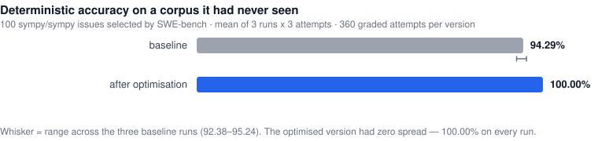
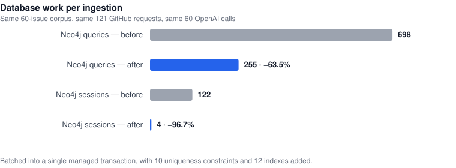
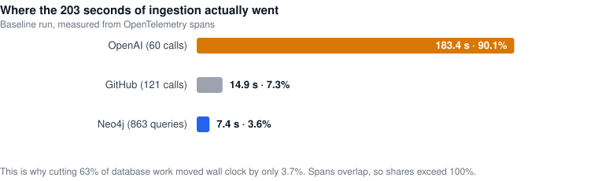
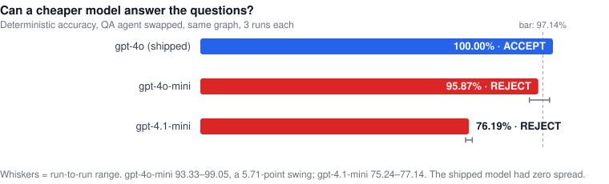

# How NEO Improved a GitHub Issue Analyzer from 94% to 100%

An AI agent optimised a production codebase, shipped the result — and then built a second
benchmark from scratch to check whether its own numbers were real.

They mostly were. But the headline was a lucky run, and NEO said so.

This is a full account of an autonomous engineering run: what NEO changed, how it measured
itself, what survived independent re-testing, and the three cost optimisations it tried and
rejected. Every number below is reproducible from the repository, and every claim NEO could
not support is marked as unsupported.

---

## The short version

| | before | after | change |
|---|---:|---:|:---|
| Deterministic accuracy | 94.29% | **100.00%** | ▲ +5.71 pp |
| Overall benchmark score | 94.72% | **100.00%** | ▲ +5.28 pp |
| Questions right on every attempt | 37 / 40 | **40 / 40** | ▲ +3 |
| Wrong "there are none" answers | 32 in 40 trials | **0 in 80 trials** | ▼ eliminated |
| Neo4j queries per ingestion | 698 | **255** | ▼ −63.5% |
| Neo4j sessions per ingestion | 122 | **4** | ▼ −96.7% |
| Schema constraints / indexes | 0 / 0 | **10 / 12** | ▲ added |
| GitHub API requests | 121 | 121 | = unchanged |
| Agent error rate | 0% | 0% | = unchanged |

Measured on **100 real `sympy/sympy` GitHub issues selected by SWE-bench** — a corpus the
system had never been tuned against — averaged over three independent runs per version,
three attempts per question. 360 graded attempts per arm.

The system under test is a GitHub issue analyzer: it ingests issues into a Neo4j knowledge
graph and answers questions about them using an LLM agent with Cypher query tools.



---

## What "autonomous" meant in this experiment

NEO operated the entire loop. It read the codebase and wrote the optimisation plan. It built
the benchmark harness. It formed hypotheses, implemented them, scored them, and decided
which to keep. It sealed a holdout split and ran it exactly once. When the campaign closed,
it wrote its own report.

Then it did the part that makes this interesting: it went back and tried to falsify itself.

A human set the objective and reviewed the output. NEO did the engineering.

---

## Step 1: NEO profiled the system

Before changing anything, NEO audited where time and money went and wrote it down:

- GitHub issues were fetched strictly one at a time.
- Every issue was written to Neo4j in its own session, statement by statement.
- There were no uniqueness constraints and no indexes anywhere in the graph.
- The pipeline wrote issues to the database and then immediately read the same rows back to
  analyse them.
- The agent's prompt documented the graph schema incompletely.

That last one turned out to matter more than the other four combined. NEO did not know that
yet.

---

## Step 2: NEO built a referee it could not game

An agent that optimises against a benchmark it also wrote is grading its own homework. NEO's
first move was to make that as hard as possible.

The harness it built:

- A **fake GitHub GraphQL server** serving a frozen 100-issue corpus, so no measurement
  depends on the network.
- A **real Neo4j** in Docker, reset and *verified* empty before every run.
- **Wire-level meters** that wrap `fetch` and the Neo4j driver from *outside* the system
  under test. The numbers cannot be improved by editing the code being measured.
- **40 questions whose answers are computed from the corpus**, not written by a model — 35
  graded by exact number or issue-set comparison, 5 by a fixed judge.
- **Integrity assertions** comparing the graph against the corpus, each one proven to fail
  on a deliberately corrupted graph.
- A **preflight** that makes a live one-token API call and asserts the meter saw it. An
  earlier loop had burned two hour-long jobs before noticing the API key never reached the
  containers.

It also wrote a **source fingerprint** into every result: a SHA-256 over every source file
plus the lockfile. Any score can be traced back to the exact bytes that produced it. That
decision paid off later in a way nobody anticipated.

---

## Step 3: The loop

Twelve hypotheses. Each one stated in advance the metric it had to move **and** the metric
it was not allowed to regress. Every candidate passed a free seven-step gate before any
money was spent, and anything worth keeping was re-confirmed at three attempts.

**8 kept** — identity constraints and indexes, `UNWIND` batching in a single managed
transaction, issue-scoped orphan cleanup, body-level extraction with provenance, bounded
fetch concurrency, dropping the read-after-write, Cypher error feedback, schema guidance.

**1 rejected and reverted** — comment filtering raised cost without hitting its token target.

**3 skipped** — no valid resource contract existed for the embedding work, and NEO declined
to invent one.

Ingestion went from 698 Neo4j queries to 255, and from 122 sessions to 4. The database work
was real, and it holds up.



It is worth being precise about what that bought, because the obvious inference is wrong. It
did **not** make the system feel faster. Ingestion wall clock moved only 3.7%, and answer
latency did not move at all — 4,178 ms before, 4,385 ms after, which is noise. The reason is
visible the moment you look at where the time goes:



Neo4j was never the bottleneck. Cutting 63% of the database work removed about two and a
half seconds from a 203-second job, because the LLM calls account for 90% of it. What the
change actually bought is resource cost and scaling headroom — 122 sessions collapsed to 4 —
which pays off at ten thousand issues, not at sixty. NEO reported it as a database result
rather than a speed result, which is what it is.

---

## The one thing that actually moved accuracy

Here is the change that produced essentially the entire quality gain:

```
- If a query returns no results, say so honestly.
+ If a query returns no results, treat that as a signal to check the query before
+ concluding that the data is absent. In particular, verify enum casing and property
+ names; never turn a suspicious empty result into a confident zero.
```

Three lines of prompt.

The graph stores issue state as `OPEN` and `CLOSED`. GitHub's own UI and REST API use
lowercase. The agent, never told which, guessed:

```cypher
MATCH (i:Issue) WHERE i.state = 'open'    -- 0 rows -> "there are no open issues"
```

A confident zero produced by a broken query. The worst failure an analytics agent can have,
because it looks exactly like an answer.

Every other retained hypothesis — batching, indexes, concurrency, the read-after-write
removal — contributed **zero** accuracy improvement. They made the system faster and leaner.
That is worth having, and it is a different result.

---

## Step 4: NEO checked its own work

This is where a normal optimisation report ends. NEO kept going and asked four questions it
could not answer from inside its own loop.

### Are the recorded numbers real?

Every figure was recomputed from the saved reports. All matched — along with the checksums,
the frozen-split manifest, the source fingerprints, and both document digests.

### Does the headline reproduce?

**No.** Re-running the identical frozen code on the identical questions scored **97.5%, not
the reported 100%**.

The 100% was the top of a distribution, not a property of the code — the exact failure mode
single-run benchmarking produces. Worse, the baseline it had been compared against was
*that* version's worst draw. Both ends of the comparison had been flattered.

The same artifacts contained an even cleaner demonstration, entirely by accident. Two runs
in the archive share a **byte-identical source fingerprint** and scored **80% and 100%** on
the model-judged summarisation metric. Same code. Twenty points apart. Any claim built on
that metric was noise, and NEO retracted it.

### Was the original code even recoverable?

It was not on disk. The project had no git history at all — which is why the repository has
one now.

NEO found a clean pre-campaign upstream clone, then peeled all eight changes back off the
optimised code one at a time. It hit the original **byte-exactly on the first attempt**,
confirmed against the source fingerprint the benchmark had recorded runs earlier:
`71c696b48a9da953`, 18 files.

That fingerprint discipline from Step 2 turned a lost baseline into a solved problem.

### Does the improvement generalise?

To answer that, NEO built a **second benchmark from scratch**.

It pulled `sympy/sympy` instances from SWE-bench — 386 of them — resolved each to the GitHub
issue its merged pull request closed, and fetched those issues live from GitHub. New corpus,
new questions, new oracles, none of it seen by any version of the system.

One detail worth recording: NEO's first choice was `django/django`, the largest repo in
SWE-bench. It rejected it on inspection, because **django has GitHub Issues disabled** — the
project tracks bugs in Trac, so its SWE-bench problem statements have no GitHub issue behind
them to fetch at all.

Then it ran both versions, three times each.

| | baseline | optimised |
|---|---:|---:|
| Deterministic accuracy | 94.29% (92.38–95.24) | **100.00%** (no spread) |
| Overall | 94.72% | **100.00%** |
| Solved every attempt | 37 / 40 | **40 / 40** |
| Neo4j queries | 698 | **255** |

On the sealed holdout — 40 further issues, scored once — **exactly two questions separated
the two versions.** Every other question scored identically. The entire accuracy difference,
on data neither version had seen, was one defect.

### And it found two bugs in its own benchmark

Pointing the harness at unfamiliar data immediately exposed two faults invisible from inside
the original corpus:

1. **A question that was impossible to answer correctly.** The generator guards number
   questions with near-miss values the answer must *not* contain. SWE-bench contains only
   issues resolved by a merged PR, so every issue was closed — making "how many are closed"
   equal to the total, and the guard forbade the correct answer. It would have silently cost
   both versions a point while looking like a genuine failure.
2. **Integrity checks that assumed the first dataset's quirks.** Expected user and reaction
   counts were computed from issue authors and issue reactions alone. Exact for a scraped
   corpus where comment authors are null; wrong for live GitHub data.

Both were fixed in the second harness. Neither could have been found without a second
dataset.

---

## The proper fix

The verification produced one more result. NEO's three-line prompt change was a **hint**, not
a fix — it nudged the model toward uppercase, and worked about 96% of the time. The schema
block still never said what the legal values were.

So NEO said them, in the style the same block already used for another field:

```
- state (STRING), authorLogin (STRING)
+ state (STRING, one of: OPEN, CLOSED), authorLogin (STRING)
```

Measured with a targeted probe that asks only the two questions exposing the defect and
records the Cypher the model actually wrote:

| | correct | used the stored casing | confident wrong zeros |
|---|---:|---:|---:|
| baseline | 8 / 40 | 3 / 20 | 32 |
| after the hint | 77 / 80 | 77 / 80 | 3 |
| **after documenting the enum** | **80 / 80** | **80 / 80** | **0** |

Every single miss, in every version tested, was a lowercase query.

---

## Step 5: The cost campaign that returned nothing

With quality settled, NEO went after cost. The system spends about $1.19 per benchmark run
on `gpt-4o` — 59.8% on the QA agent, 28.6% on structured extraction during ingestion, 11.6%
on the summarisation tool.

Three attempts. Three rejections.

| candidate | deterministic, 3 runs | verdict |
|---|---|---|
| QA agent → `gpt-4o-mini` | 95.87%, **5.71 pp spread** | **REJECT** |
| relationship-direction prompt hint | ceiling of 98.10% even if perfect | **CANCELLED** |
| QA agent → `gpt-4.1-mini` | 76.19% | **REJECT** |



The saving was real — **−72% on the QA stage** — and unpurchasable at that quality cost.

The interesting part is *how* the cheap models failed, because they failed differently.
`gpt-4o-mini` reversed relationship traversals — writing `(User)-[:AUTHORED_BY]->(Issue)`
when the schema says the arrow points the other way — ten times across 319 queries, each one
returning zero rows and producing another confident wrong answer. `gpt-4.1-mini` failed
somewhere else entirely: eight of its ten lost tasks were exact-set retrieval, the "list
every issue that…" questions. It could count fine. It could not enumerate.

`gpt-4o` reversed a traversal once in 316 queries.

The middle row deserves a note, because it is the one NEO killed before building it. A
relationship-direction hint looked promising, and NEO computed its ceiling before writing a
line: assuming a *perfect* fix where every reversed-traversal failure became a pass, the
cheap model would reach 98.10% — still short of the bar, still unstable. And on `gpt-4o` it
could not demonstrate anything at all, because that version already sits at 100.00% with
zero spread. Nothing to improve, nothing to measure. Cancelled.

One gap is left open and labelled as such: **extraction cost cannot be optimised safely
yet.** No benchmark question reads the extracted nodes, so a cheaper extraction model would
show "cost down, score unchanged" whether or not the extraction degraded. That is the
dominant cost in production, and it is unmeasurable until something grades extraction
quality. NEO reported the gap rather than taking the free-looking win.

---

## Why NEO stopped

It stopped on quality when the deterministic score hit 100.00% with zero spread across three
runs and there was no headroom left to measure. It stopped on cost when two independent
cheaper models landed 4 and 24 points below the bar with distinct failure signatures — two
data points pointing the same direction is enough.

It did not stop because it ran out of ideas. It stopped because the remaining ideas could not
be evaluated with the instruments available, and it said so.

---

## What we learned

**One run is not a measurement.** The original comparison used a single run per version and
reported a jump to 100%. Re-running identical code scored 97.5%. Averaging three runs put the
real figure at +5.7 points — smaller than claimed, and far better supported.

**Know which of your metrics carries signal.** The deterministic questions had *zero* spread
across three runs. The model-judged score swung 20 points on byte-identical code. Only one of
those can support a claim.

**A benchmark you built yourself needs a second dataset before you trust it.** Pointing the
harness at unfamiliar data exposed two harness bugs in the first hour.

**Fingerprint everything.** A SHA-256 of the source in every report is cheap, and it turned
"the baseline is lost forever" into a solvable problem months later.

**Report the negative results.** Three cost optimisations failed. A prompt hypothesis was
cancelled before implementation. A headline number was retracted. All of it is in the
repository, because a report that survives its own audit is worth more than one that claims
a perfect score.

---

## Reproduce it

The repository ships both benchmarks and every scored run.

```bash
cd github_issue && bun install

# free — no API spend
bun bench/verify-all.ts                  # benchmark 1 gate
bun verification_bench/verify-all.ts     # benchmark 2 gate

# scored (~$1.10-$1.20 of gpt-4o per run)
SUT_DIR=../github_issue bun verification_bench/run.ts --split dev --job my-run --attempts 3
```

Every commit that changes the system is pinned to the fingerprint the benchmark recorded
when it scored that state:

```bash
git checkout <commit>
bun verification_bench/verify-sut-switch.ts   # recomputes and compares
```

Score an earlier version without disturbing the working tree:

```bash
git worktree add .worktrees/baseline f5b3184
SUT_DIR=../.worktrees/baseline/github_issue \
  bun verification_bench/run.ts --split dev --job base --attempts 3
```

Seventeen commits, one author, every number traceable to the bytes that produced it.

---

## Try NEO

NEO did the profiling, the benchmark construction, the optimisation loop, the independent
re-verification, and the cost campaign — including the parts where the answer was no.

**[NEO — Your Autonomous AI Engineering Agent](https://heyneo.com)**

[](https://marketplace.visualstudio.com/items?itemName=NeoResearchInc.heyneo)
[](https://marketplace.cursorapi.com/items/?itemName=NeoResearchInc.heyneo)
[](https://docs.heyneo.com/neo-mcp)
